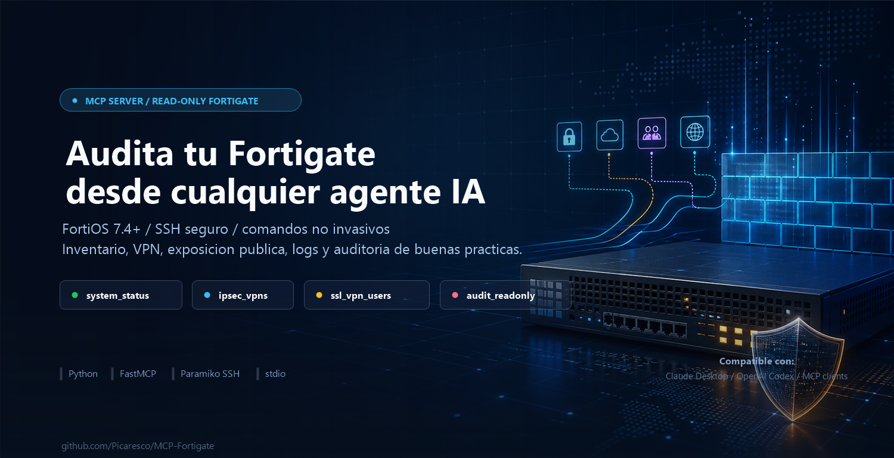

# Fortigate MCP

Servidor MCP local para consultar Fortigate por SSH en modo solo lectura.

Pensado para FortiOS 7.4+ y para usarse desde Codex y Claude Desktop mediante transporte `stdio`.

## Seguridad

Este MCP no ejecuta comandos libres. Todas las herramientas son read-only y el comando manual `fortigate_run_readonly_command` valida una allowlist estricta.

Bloquea tokens como `config`, `edit`, `set`, `unset`, `delete`, `purge`, `execute`, `reboot`, `shutdown`, `restore`, `factoryreset`, `format` y `debug`.

La seguridad real debe reforzarse tambien en el Fortigate usando un usuario con perfil de solo lectura.

## Instalacion

```powershell
py -3 -m venv .venv
.\.venv\Scripts\python.exe -m pip install -r requirements.txt
Copy-Item fortigate.config.example.json fortigate.config.json
```

Tambien se puede instalar como paquete Python desde PyPI:

```powershell
python -m pip install fortigate-readonly-mcp
```

Edita `fortigate.config.json`:

```json
{
  "fortigate": {
    "host": "192.168.1.1",
    "port": 22,
    "username": "admin",
    "password": "change-me",
    "timeout": 15,
    "banner_timeout": 15,
    "auth_timeout": 15,
    "look_for_keys": false,
    "allow_agent": false,
    "disabled_algorithms": {}
  }
}
```

`fortigate.config.json` esta ignorado por Git.

## Herramientas MCP

- `fortigate_list_allowed_commands`
- `fortigate_get_system_status`
- `fortigate_get_interfaces`
- `fortigate_get_routes`
- `fortigate_get_firewall_policies`
- `fortigate_get_ipsec_vpns`
- `fortigate_get_ssl_vpn_users`
- `fortigate_get_ssl_vpn_lan_connections`
- `fortigate_get_auth_attack_summary`
- `fortigate_run_audit_readonly`
- `fortigate_get_public_exposure`
- `fortigate_find_policy_by_ip`
- `fortigate_get_interface_health`
- `fortigate_get_vpn_overview`
- `fortigate_export_readonly_snapshot`
- `fortigate_run_readonly_command`

## Ejemplos de uso

Los siguientes ejemplos son ficticios y solo muestran el tipo de preguntas que puedes hacer desde un agente compatible con MCP.

### Diagnostico general

**Peticion**

```text
Hazme un diagnostico basico del Fortigate.
```

**Respuesta de ejemplo**

```text
Fortigate FG-80F / FortiOS 7.4.x

Estado general:
- Uptime: 128 dias
- CPU: 4%
- Memoria: 58%
- Sesiones activas: 8.421
- Modo: NAT

Observaciones:
- Rendimiento estable.
- No se observan interfaces fisicas con errores relevantes.
- Hay 2 tuneles IPsec caidos que conviene revisar.
```

### Tuneles IPsec

**Peticion**

```text
Listame las conexiones IPsec con entidades externas y dime cuales estan caidas.
```

**Respuesta de ejemplo**

```text
Tuneles IPsec:

| Nombre              | Peer publico    | Estado | Observacion                  |
|---------------------|-----------------|--------|------------------------------|
| vpn-acme-main       | 203.0.113.10    | UP     | Trafico reciente             |
| vpn-partner-backup  | 198.51.100.25   | DOWN   | Sin fase 2 activa            |
| vpn-datacenter      | 203.0.113.80    | UP     | Estable                      |

Resumen: 2 tuneles activos, 1 tunel caido.
```

### Usuarios SSL-VPN

**Peticion**

```text
Que usuarios estan conectados ahora por VPN y a que equipos internos acceden?
```

**Respuesta de ejemplo**

```text
Usuarios SSL-VPN conectados:

| Usuario       | IP VPN        | Origen publico | Destinos LAN observados       |
|---------------|---------------|----------------|-------------------------------|
| ana.garcia    | 10.212.10.14  | 198.51.100.44  | 10.10.20.15:3389              |
| soporte.n1    | 10.212.10.18  | 203.0.113.52   | 10.10.30.20:443, 10.10.30.5:22 |

Nota: la vista se basa en sesiones activas observadas en el Fortigate.
```

### Exposicion publica

**Peticion**

```text
Muestrame que servicios internos estan publicados hacia Internet.
```

**Respuesta de ejemplo**

```text
Exposicion publica detectada:

| VIP              | IP publica     | Destino interno | Servicio |
|------------------|----------------|-----------------|----------|
| vip-portal       | 203.0.113.120  | 10.10.40.10     | HTTPS    |
| vip-rdp-soporte  | 203.0.113.121  | 10.10.50.25     | RDP      |

Recomendacion:
- Revisar si RDP debe seguir expuesto publicamente.
- Aplicar restricciones por origen si el servicio es necesario.
```

### Ataques de usuario y contrasena

**Peticion**

```text
Tenemos ataques de usuario y contrasena contra el Fortigate?
```

**Respuesta de ejemplo**

```text
Resumen de autenticacion reciente:

- SSL-VPN: 37 fallos de login en la ultima hora.
- Administracion HTTPS/SSH: sin fallos relevantes.
- IPs con mas intentos:
  - 198.51.100.200: 22 intentos
  - 203.0.113.77: 9 intentos

Posible fuerza bruta contra SSL-VPN.
```

### Auditoria read-only

**Peticion**

```text
Haz una auditoria de seguridad del Fortigate y prioriza los hallazgos.
```

**Respuesta de ejemplo**

```text
Hallazgos prioritarios:

1. Firmware pendiente de revision
   - Version observada: FortiOS 7.4.x
   - Accion: comparar con el ultimo release recomendado por Fortinet.

2. Servicios publicados hacia Internet
   - Detectados VIPs con HTTPS y RDP.
   - Accion: validar necesidad, origenes permitidos y logging.

3. Tuneles VPN caidos
   - 1 tunel IPsec sin fase 2 activa.
   - Accion: revisar propuestas y conectividad con el peer.

4. SSL-VPN
   - Usuarios conectados y sesiones LAN activas.
   - Accion: revisar MFA, grupos permitidos y politicas asociadas.
```

## Configuracion para Claude Desktop

Anade este servidor en el JSON de Claude Desktop, ajustando la ruta si cambia:

```json
{
  "mcpServers": {
    "fortigate": {
      "command": "C:\\ruta\\al\\proyecto\\.venv\\Scripts\\python.exe",
      "args": [
        "C:\\ruta\\al\\proyecto\\server.py"
      ],
      "env": {
        "FORTIGATE_MCP_CONFIG": "C:\\ruta\\segura\\fortigate.config.json"
      }
    }
  }
}
```

Si lo instalas desde PyPI en vez de ejecutar el `server.py` del repo, puedes usar el comando `fortigate-mcp`:

```json
{
  "mcpServers": {
    "fortigate": {
      "command": "fortigate-mcp",
      "env": {
        "FORTIGATE_MCP_CONFIG": "C:\\ruta\\segura\\fortigate.config.json"
      }
    }
  }
}
```

## Configuracion para Codex

Anade este bloque a `%USERPROFILE%\.codex\config.toml`:

```toml
[mcp_servers.fortigate]
command = 'C:\ruta\al\proyecto\.venv\Scripts\python.exe'
args = ['C:\ruta\al\proyecto\server.py']

[mcp_servers.fortigate.env]
FORTIGATE_MCP_CONFIG = 'C:\ruta\segura\fortigate.config.json'
```

## Prueba rapida

Validar sintaxis:

```powershell
.\.venv\Scripts\python.exe -m py_compile server.py
```

Verificar con MCP Inspector:

```powershell
npx @modelcontextprotocol/inspector .\.venv\Scripts\python.exe server.py
```
